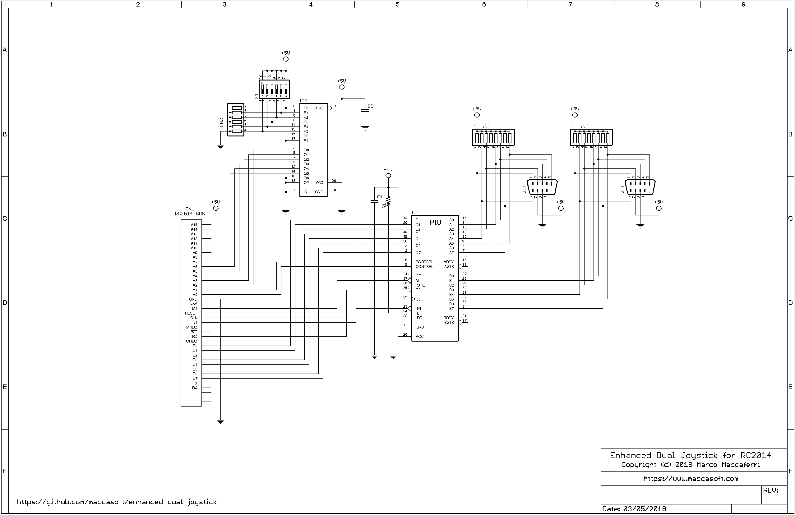
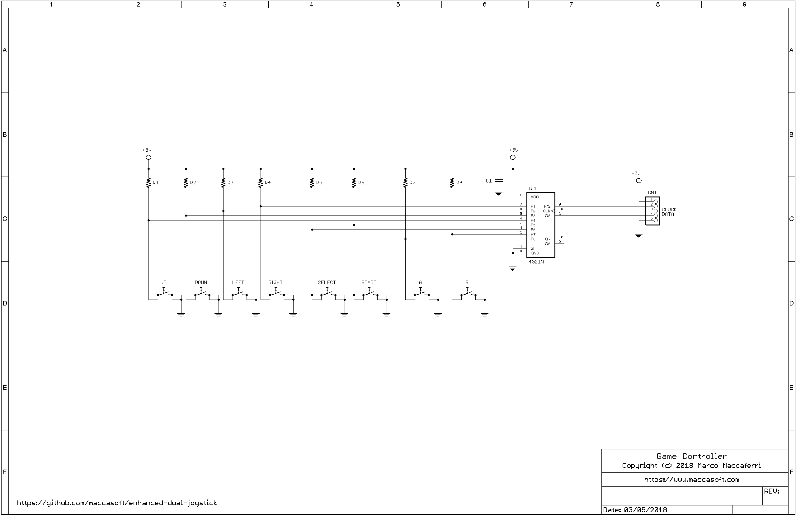

## Enhanced Dual Joystick for RC2014

Add-on board designed for the [RC2014](http://rc2014.co.uk/) computer to provide an enhanced dual joystick port for games and other applications.

The board is based on a Z80 PIO that provide two 8-bit bi-direction parallel ports. Software can configure each port independently to use a standard Atari-compatibile joystick, a NES-compatible gamepad or any
other controller driven by digital I/O lines.

I/O ports can be configured with the on-board dip-switch.

### Schematics




| Parts List  |                                     |
| ----------- | ----------------------------------- |
| R1          | 10.000 ohm 1/4 watt                 |
| RN1, RN2    | 10.000 ohm, 9-pin resistor network  |
| RN3         | 10.000 ohm, 7-pin resistor network  |
| C1, C2      | 100.000 pF polyester                |
| IC1         | Z84C2010PEG                         |
| IC2         | CD74HCT688N                         |
| S1          | DIP-switch                          |
| CN1         | 40 pin male header, right angle     |
| CN2, CN3    | DB9 male connector                  |


Additionally, a NES-compatible gamepad board is included for those who don't have access to an existing joystick.





| Parts List            |                           |
| --------------------- | ------------------------- |
| R1-R8                 | 10.000 ohm 1/4 watt       |
| C1                    | 100.000 pF polyester      |
| IC1                   | CD4021                    |
| UP, DOWN, LEFT, RIGHT | 6x6 mm tact switches      |
| SELECT, START, B, A   | 6x6 mm tact switches      |
| CN1                   | 5-pin connector           |


### Code Examples

The Z80 PIO must be initialized at startup by configuring both ports in control mode 3 followed by the pin direction settings appropriate for
the game controller type.

**Atari 2600 joystick.**

```
PIO_BASE    .EQU    70H

            ; initialize

            LD      A,0CFH              ; set port A mode 3 (control)
            OUT     (PIO_BASE+1),A
            LD      A,0FFH              ; all pins as input
            OUT     (PIO_BASE+1),A

            LD      A,0CFH              ; set port B mode 3 (control)
            OUT     (PIO_BASE+3),A
            LD      A,0FFH              ; all pins as input
            OUT     (PIO_BASE+3),A

            ; read joystick 1

            IN      A,(PIO_BASE)

            ; read joystick 2

            IN      A,(PIO_BASE+2)
```

**NES gamepad on Joystick 2.**

The code assumes that the gamepad is wired to the DB9 connector as follows: 4=data, 5=load, 6=clk.  

```
PIO_BASE    .EQU    70H

NES_LOAD    .EQU    20H
NES_CLK     .EQU    10H

            ; initialize

            LD      A,0CFH              ; set port A mode 3 (control)
            OUT     (PIO_BASE+1),A
            LD      A,0FFH              ; all pins as input
            OUT     (PIO_BASE+1),A

            LD      A,0CFH              ; set port B mode 3 (control)
            OUT     (PIO_BASE+3),A
            LD      A,~(NES_LOAD|NES_CLK)   ; clock and load pins as output, others as input
            OUT     (PIO_BASE+3),A
            LD      A,0
            OUT     (PIO_BASE+2),A

            ; read joystick 1

            IN      A,(PIO_BASE)

            ; read joystick 2

            LD      C,0

            LD      A,NES_LOAD          ; pulse load pin
            OUT     ((PIO_BASE+2),A
            LD      A,0
            OUT     (PIO_BASE+2),A

            LD      B,8
L1:         IN      A,(PIO_BASE+2)      ; read data from bit 0
            RRA
            RL      C

            LD      A,NES_CLOCK         ; pulse clock
            OUT     (PIO_BASE+2),A
            LD      A,0
            OUT     (PIO_BASE+2),A

            DJNZ    L1

            LD      A,C
```

### Boards

Boards are shared on OSHPark:

[Dual Joystick](https://oshpark.com/shared_projects/1jlMB1r2)  
[Game Controller](https://oshpark.com/shared_projects/LxgxoR9j)  


A [donation](https://www.paypal.me/maccasoft/5eur) to support this and future projects is always welcome!

